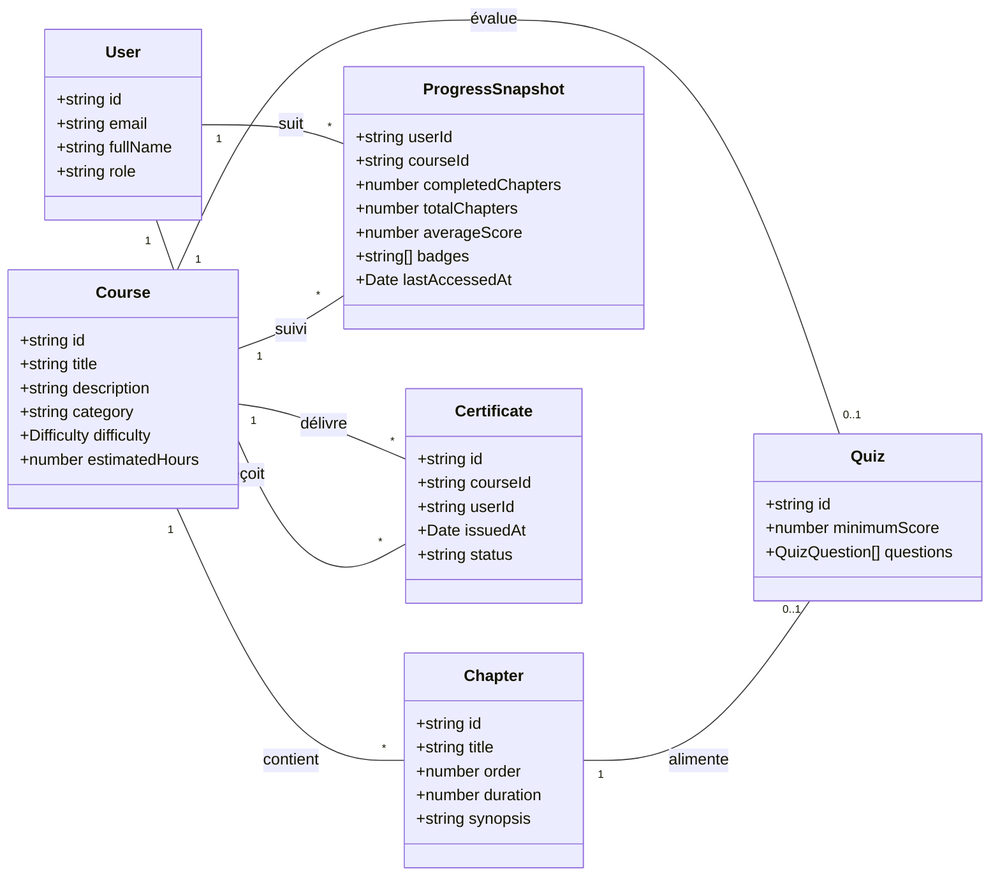

# Diagramme UML — E-learning Platform

Ce diagramme capture le modèle de données métier et peut être exporté visuellement via n'importe quel outil supportant Mermaid (ex : VS Code, GitHub, Mermaid Live Editor).
